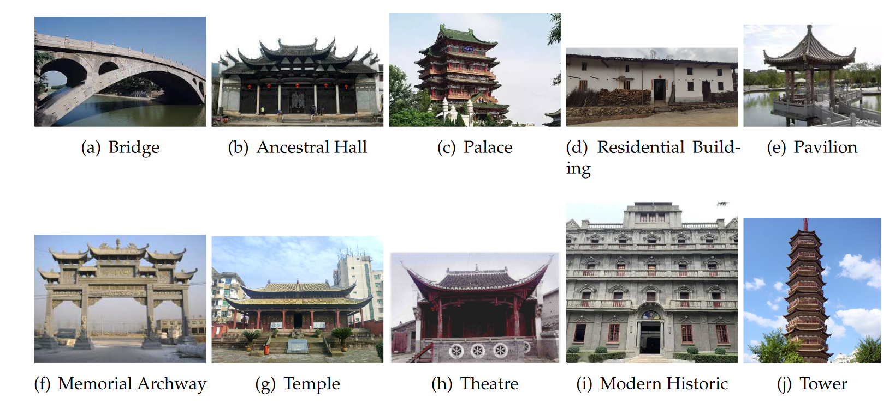

## Usage

##### Data Set
Our dataset is available by contacting bowen.wang@is.ids.osaka-u.ac.jp 
##### Data Samples


##### Training
Using the following command
```
python main.py ----data_root [your root to place the dataset] --output_dir [root for save the model] --base_model resnet18
```

##### Evaluating
```
python evaluation.py 
```

##### Evaluating
```
python retrieval.py --index [the number to choose the inference sample image]
```

##### UMAP Visualization
```
python umap.py 
```

## Publication
If you want to use this work, please consider citing the following paper.
```
@Article{buildings12060809,
AUTHOR = {Ma, Kai and Wang, Bowen and Li, Yunqin and Zhang, Jiaxin},
TITLE = {Image Retrieval for Local Architectural Heritage Recommendation Based on Deep Hashing},
JOURNAL = {Buildings},
VOLUME = {12},
YEAR = {2022},
NUMBER = {6},
ARTICLE-NUMBER = {809},
URL = {https://www.mdpi.com/2075-5309/12/6/809},
ISSN = {2075-5309},
ABSTRACT = {Propagating architectural heritage is of great significance to the inheritance and protection of local culture. Recommendations based on user preferences can greatly benefit the promotion of local architectural heritage so as to better protect and inherit historical culture. Thus, a powerful tool is necessary to build such a recommendation system. Recently, deep learning methods have proliferated as a means to analyze data in architectural domains. In this paper, based on a case study of Jiangxi, China, we explore a recommendation system for the architectural heritage of a local area. To organize our experiments, a dataset for traditional Chinese architecture heritage is constructed and a deep hashing retrieval method is proposed for the recommendation task. By utilizing a data fine-tuning strategy, our retrieval method can realize high-accuracy recommendation and break the model training restriction caused by insufficient data on local architectural heritage. Furthermore, we analyze the retrieval answers and map the data into a two-dimensional space to reveal the relationships between different architectural heritage categories. An image-to-location application is also provided for a better user experience.},
DOI = {10.3390/buildings12060809}
}

```